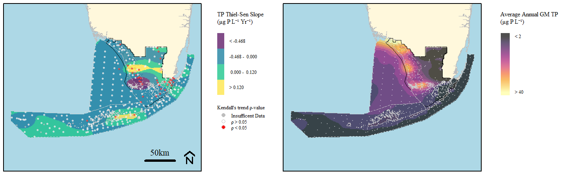
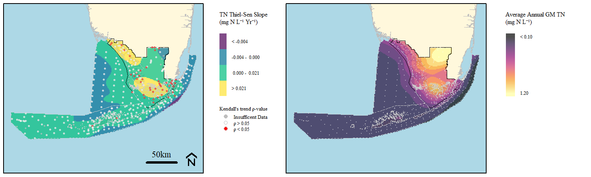
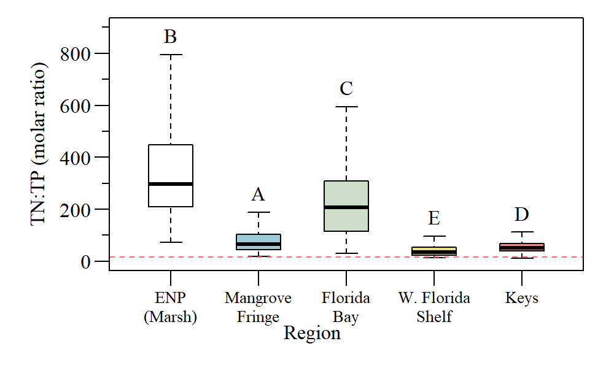
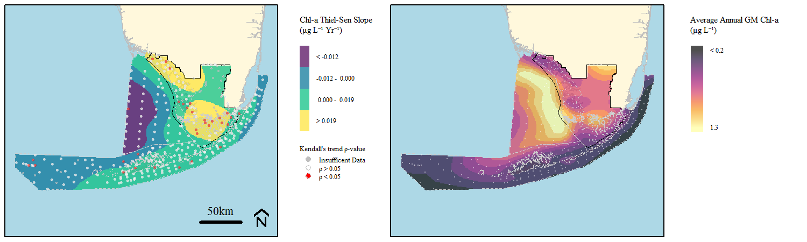
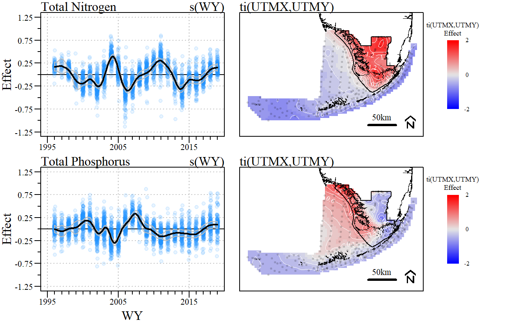
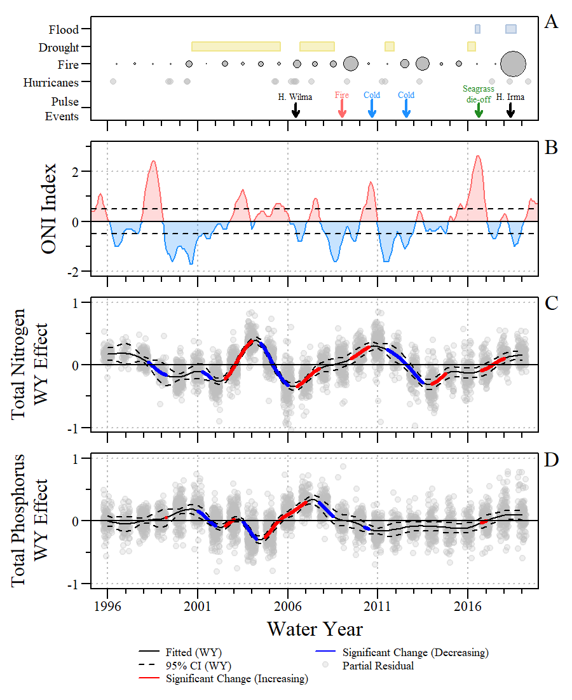
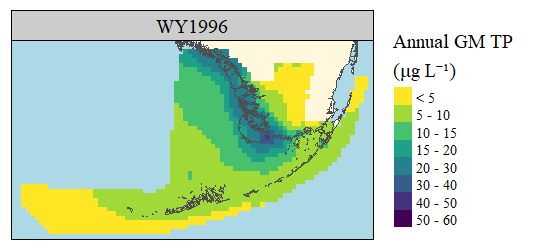
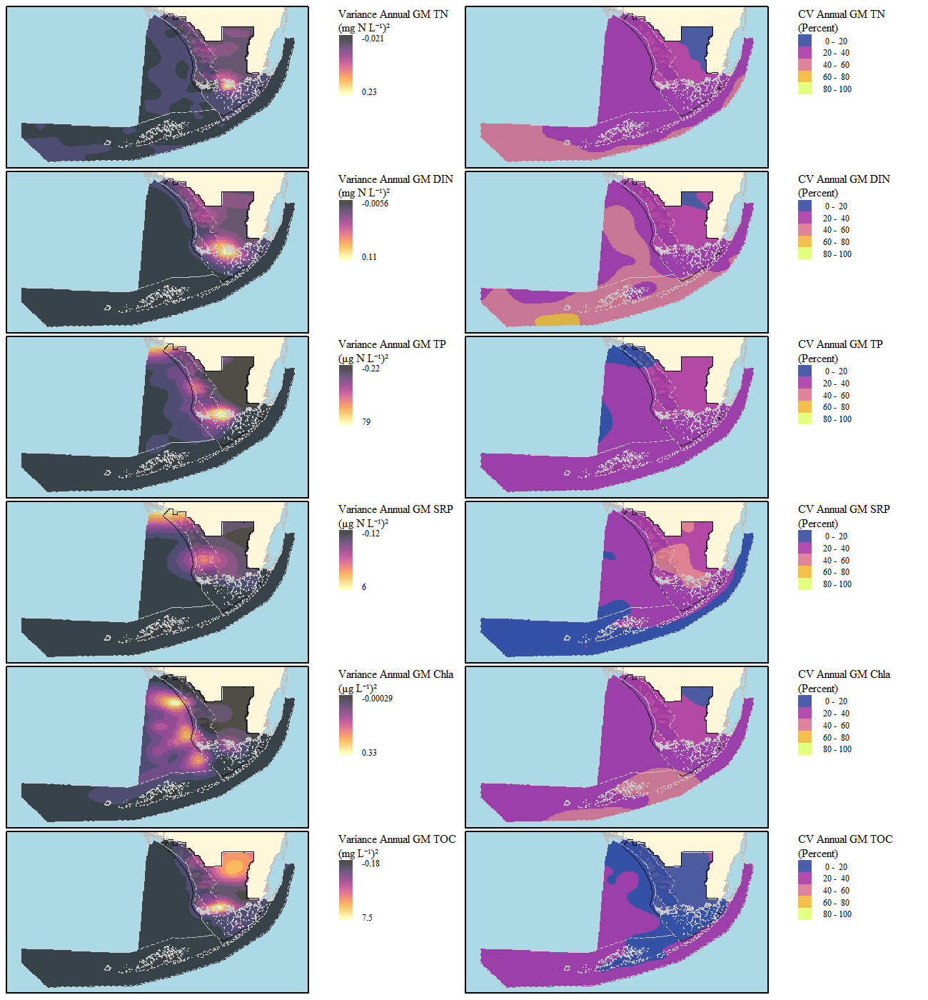
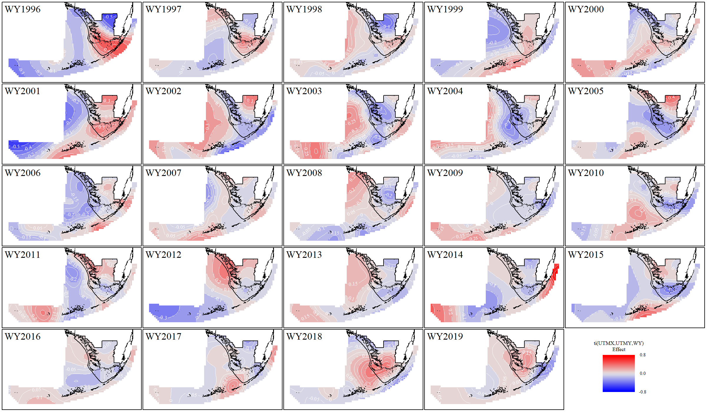

```{r xaringanExtra, include=FALSE, warnint=FALSE}
# devtools::install_github("gadenbuie/xaringanExtra")
# xaringanExtra::use_webcam()
xaringanExtra::use_tile_view()
# xaringanExtra::use_scribble()
# xaringanExtra::use_progress_bar("red", "bottom","0.25em")
```

```{r setup, include=FALSE}
library(knitr)

options(htmltools.dir.version = FALSE)
knitr::opts_chunk$set(warning = FALSE, message = FALSE, echo=FALSE)

##
library(flextable)
library(magrittr)
library(plyr)
library(reshape2)

wd="C:/Julian_LaCie/_GitHub/EVER_FKNMS_WQTrend"

plot.path="C:/Julian_LaCie/_GitHub/EVER_FKNMS_WQTrend/Plots/"
export.path="C:/Julian_LaCie/_GitHub/EVER_FKNMS_WQTrend/Export/"

plot.figs=list.files(plot.path,full.names=T)
plot.figs=plot.figs[plot.figs!="C:/Julian_LaCie/_GitHub/EVER_FKNMS_WQTrend/Plots/tiff"]
slides.figs="C:/Julian_LaCie/_GitHub/EVER_FKNMS_WQTrend/slides/plots"
file.copy(plot.figs,slides.figs,overwrite=T,recursive=T)

### 
# Functions
notidy_as_flextable_gam<-function(x,data_t=NULL,data_g=NULL,dig.num=2,r2dig=2,...){
  # needs flextable
  # magrittr
  if(sum(class(x)%in%c("gam"))==1&is.null(data_t)&is.null(data_g)){
    data_t <- notidy_tidy_gam(x)
    data_g <- notidy_glance_gam(x)
  }
  
  std_border=officer::fp_border(color = "black", style = "solid", width = 2)
  data.frame(data_t)%>%
    flextable()%>%
    delete_part(part="header")%>%
    hline(i=which(data_t=="Component"),border=std_border)%>%
    hline(i=which(data_t=="Component")[2]-1,border=std_border)%>%
    bold(i=which(data_t=="Component"))%>%
    align(j=1,part="all")%>%
    hline_top(border=std_border)%>%
    hline_bottom(border=std_border)%>%
    merge_v(j=1)%>%valign(j=1,valign="top")%>%fix_border_issues()%>%
    autofit(part = c("header", "body"))%>%
    add_footer_lines(values = c(
      sprintf("Adjusted R-squared: %s, Deviance explained %s", formatC(data_g$adj.r.squared,digits = r2dig,format="f"), formatC(data_g$deviance,digits = r2dig,format="f")),
      paste0(data_g$method,": ",format(round(data_g$sp.crit,dig.num),dig.num),", Scale est.: ",format(round(data_g$scale.est,dig.num),dig.num),", N: ",data_g$nobs)
    ))
}

```

layout: true

---
name: title
class: left, middle

### Fighting the Tides: Long term spatial and temporal trends of a tropical Freshwater-Estuary-Marine ecosystem.

`r paste(format(as.Date("2022-01-14"),"%B %d, %Y"))#,"<br>(Updated:", format(as.Date(Sys.Date()),"%B %d, %Y"),")")`


<!-- this ends up being the title slide since seal = FALSE-->


.footnote[
Paul Julian PhD [`r fontawesome::fa("fas fa-envelope")`](mailto: pjulian@sccf.org) .small[pjulian@sccf.org]

.small[Use cursor keys for navigation, press .red["O"] for a slide .red[O]verview]

```{r} 
bsplus::bs_button(
    label = "Download PDF Version",
    button_type = "primary",
    button_size = "small") %>%
    htmltools::a(
      href = "https://swampthingecology.org/EVER_FKNMS_WQTrend/slides/20220114_FCEBrownBag.pdf"
      )
```
]

---
name: acknowledgements

### Co-authors (in no particular order of importance)
Joseph N. Boyer, Stephen Davis, Jim Fourqurean, Evelyn E. Gaiser, John S Kominoski, Chris Madden, Donatto Surratt & Serge Thomas

--

### Land Acknowledgment
I'm presenting to you from the former lands of the Calusa. The Everglades, as we know it today, have been cared for by innumerable generations of original peoples of the past, whose memory we honor. Today, these lands are cared for by the indigenous sovereignties known as the Miccosukee Tribe of Florida, the Seminole Tribe of Florida, and the Sovereign Miccosukee Seminole Nation. We pay respect to their Elders past, present and future as we learn from this land.

--

### Ecosystem Acknowledgment
We acknowledge the diversity of the ecosystems discussed today, from the iconic Ridge and Slough to seagrass meadows, barrier islands, and reefs. The ecosystems of south Florida are valuable beyond the vast array of ecosystem services it provides. 

---
name: disturb101


```{r,out.width="50%",fig.align="center",fig.cap="A general model of disturbance by Peters et al 2011 adapted by Grimm et al (2017)" }


```

--

* Disturbances are crucial drivers of ecological processes
  * Some level of stress leads to disruptions

--

* Applied to exogenic and and endogenic disturbances.

.footnote[
.small[
* Grimm et al (2017) Does the ecological concept of disturbance have utility in urban social–ecological–technological systems? [Ecosystem Health and Sustainability](https://esajournals.onlinelibrary.wiley.com/doi/abs/10.1002/ehs2.1255)

* Peters et al (2011) Cross-system comparisons elucidate disturbance complexities and generalities. [Ecosphere](https://esajournals.onlinelibrary.wiley.com/doi/full/10.1890/ES11-00115.1)
*Grim
]
]

---
name: disturb102


```{r,out.width="50%",fig.align="center",fig.cap="Modified coneptual framework on disturbance ecology and links to events, effects and trajectories by Gaiser et al (2020)" }


```
.pull-left[
* Slightly modified from Peters et al and Grimm et al
  * Human dimension of disturbance, feedback loops and effects (intended and unintended)
]

.pull-right[
* Understanding the role of disturbances in regulating ecosystems is complicated 
  * Type (press vs pulse), magnitude (episodic vs constant/gradual), duration, frequency, spatial scale, disturbance legacies
]

.small[
Gaiser et al (2020) Long-Term Ecological Research and Evolving Frameworks of Disturbance Ecology. [BioScience 70:141–156.](https://doi.org/10.1093/biosci/biz162)
]


---
name: disturb103

### Pulse
.pull-left[
```{r,out.width="100%",fig.align="center",fig.cap="Quantifying the dimensions of pulse events from Jentsch and White (2019)." }


```


]

.pull-right[
Pulse events can be characterized by: 
1. fluctuation in physical environmental conditions .small[(i.e. heat waves, droughts)]
2. abiotic changes in resource supplies .small[(i.e. upwelling, lake turnover)]
3. change in biotic resources through sudden demographic events .small[(i.e. mortality events)]
4. changes through abrupt alteration of biotic structure .small[(i.e. biomass altering process)]
5. Spatial subsidies (transfer resources across space)
]


.footnote[
.small[
Jentsch A, White P (2019) A theory of pulse dynamics and disturbance in ecology. [Ecology](https://esajournals.onlinelibrary.wiley.com/doi/abs/10.1002/ecy.2734)

]
]
---
name: disturb104

### Pulse-Press-Ramp
.pull-left[
```{r,out.width="50%",fig.align="center",fig.cap="Generalized examples of disturbance from Lake (2000)." }


```


]

.pull-right[

**A)** Pulse events - short term and sharply delineated disturbances

**B)** Press events - arise sharply then reach a constant level (i.e. sedimentation post-landslide)

**C)** Ramp events - strength of a disturbance steadily increases over time (i.e. SLR)
  * nuanced press event or press with pulse events intermixed (maybe an integrated disturbance?)

]


.footnote[
.small[
Lake (2000) Disturbance, patchiness, and diversity in streams. [Journal of the North American Benthological Society 19:573–592](https://www.journals.uchicago.edu/doi/full/10.2307/1468118).

]
]

---
name: disturb104

### Stable States
.pull-left[
```{r,out.width="100%",fig.align="center"}

knitr::include_graphics("./plots/background/Beisneretal_Fig1.jpg")
```

.small[
Beisner B, Haydon D, Cuddington K (2003) Alternative stable states in ecology. [Frontiers in Ecology and the Environment](https://onlinelibrary.wiley.com/doi/abs/10.1890/1540-9295%282003%29001%5B0376%3AASSIE%5D2.0.CO%3B2)
]

]

.pull-left[
```{r,out.width="50%",fig.align="center"}


```

.small[
Hobbs WO, Hobbs JMR, LaFrançois T, et al (2012) A 200-year perspective on alternative stable state theory and lake management from a biomanipulated shallow lake. [Ecological Applications](https://onlinelibrary.wiley.com/doi/abs/10.1890/11-1485.1)

]

]

---
name: legacy

### Disturbance Legacy - FCE Edition

```{r,out.width="70%",fig.align="center",fig.cap="Disturbance history of ecologically important events that occurred within the Florida Coastal Everglades from Kominoski et al (2020)"}


```

Subtropical coastal systems are exposed to multiple disturbances operating at many spatiotemporal scales that influence biogeochemistry, including long-term presses (i.e., sea-level rise, freshwater restoration), episodic regional pulses (i.e., hurricanes, droughts, temperature extremes, fires), and localized ecosystem legacies of both presses and pulses (i.e., seagrass die-off, peat collapse). 

.footnote[
.small[
Kominoski JS, Gaiser EE, Castaneda‐Moya E, et al (2020) Disturbance legacies increase and synchronize nutrient concentrations and bacterial productivity in coastal ecosystems. [Ecology](https://esajournals.onlinelibrary.wiley.com/doi/10.1002/ecy.2988)

]
]

---
name: hurricane

### Here's the story of the Hurricane(s) ...

```{r,out.width="100%",fig.align="center",fig.cap="History of hurricane and tropical storms across South Florida."}


```

---
name: hurricane

### Here's the story of the Hurricane(s) ... past 2

```{r,out.width="100%",fig.align="center",fig.cap="Hurricane and tropical storms (centerline) frequency analysis across South Florida."}


```

---
name: fire

### ...we didn't light it, but we tried to fight it...

```{r,out.width="100%",fig.align="center",fig.cap="Fire occurance frequency analysis across Everglades National Park."}


```


---
name: Hydro

<br>
```{r,out.width="100%",fig.align="center",fig.cap="Annual hydroperiod and discharge volumes for Shark River Slough (SRS; top) and Taylor Slough and Coastal Basins (TSCB; bottom) between May 1, 1995 and Apirl 30, 2019 (WY1996 – 2019). "}


```


---
name: objectives

### Objective

* Compile a robust multi-decadal dataset on total and dissolved nutrient concentrations and chlorophyll-a across a coastal wetland-estuary-marine continuum to evaluate biogeochemical signals of disturbance at an unprecedented landscape scale

### Questions

This study was used to address two specifc questions related to temporal and spatial trends in water quality: 
1. Where is the greatest rate of direction change in biogeochemical constituents? 

2. Do spatial patterns of biogeochemical change and disturbance interact?

---
name: data

### Data

* Water Quality Data collected between May 1995 and May 2019

**Data Sets**
* Southeast Environmental Research Center of Florida International University (SERC)
* Florida Coastal Long-Term Ecological Research (FCE LTER)
* South Florida Water Management District (SFWMD)

**Parameters**
* Total phosphorus (TP)
* Ortho-phosphate/soluable-reactive phosphorus (SRP)
* Total nitrogen (TN)
* Dissolved inorganic nitrogen (DIN; calculated as nitrate + nitrite + ammonia)
* Chlorophyll-a (Chl-a)
* Total Dissolved Carbon (TOC)
* TN:TP molar ratio

**Analyses**
* Kruskal-Wallis (and Dunn's multiple comparison test) between regions
* Annual Kendall trend (and Thiel-Sen slope) test
* Spatio-temporal Generalized Additive Model

---
name: map

### Sampling Map

```{r,out.width="100%",fig.align="center",fig.cap="Long-term monitoring locations sampled by SERC, FCE and SFWMD."}

knitr::include_graphics("./plots/SamplingMap.png")
```

---
name: RegionalComp

### Regional Comparison

```{r,out.width="70%",fig.align="center",fig.cap="Comparison of annual geometric mean total nitrogen (TN), dissolved inorganic nutrient (DIN), total phosphorous (TP), soluble reactive phosphorus (SRP), chlorophyll-a (Chl-a), and total organic carbon (TOC) concentrations across the five regions across the study area. Letters above boxplots indicate pairwise comparisons between regions using Dunn’s test of multiple comparisons."}

knitr::include_graphics("./plots/RegionComp.png")
```

---
name: TPTrend

### Total Phosphorus Trend

```{r,out.width="120%",fig.align="center",fig.cap="Annual rate of change for geometric mean total phosphorus (TP) concentrations and average annual geometric mean TP concentrations at individual stations across the Everglades-Florida Bay-West Florida Shelf-Keys ecosystem during the period of record."}


```

* Significant decreases in Freshwater Everglades (Restoration...Thank You!).

* Significant increases in coastal mangrove fringes (TP highest in this region).
  * Ecotone effect?
  * Biomass turnover?
  * Press/Pulse Disturbance?
 
---
name: TNTrend

### Total Nitrogen Trend

```{r,out.width="120%",fig.align="center",fig.cap="Annual rate of change for geometric mean total nitrogen (TN) concentrations and average annual geometric mean TN concentrations at individual stations across the Everglades-Florida Bay-West Florida Shelf-Keys ecosystem during the period of record."}


```

* Significant increases lower Shark River, Coastal fringe and Florida Bay.
  * Ecotone effect?
  * Biomass turnover? (fringe = Mangrove; Florida Bay = Seagrass)
  * Press/Pulse Disturbance?

* Florida Bay average concentrations lower than freshwater Everglades.
---
name: NPTrend

### N:P Trend

```{r,out.width="120%",fig.align="center",fig.cap="Annual rate of change for geometric mean total nitrogen to total phosphorus (TN:TP) molar ratio and average annual geometric mean TN:TP at individual stations across the Everglades-Florida Bay-West Florida Shelf-Keys ecosystem during the period of record."}


```

* Increases in P limitation in eastern Florida Bay.

* Reef track and Shelf co-limited or N-limited.

---
name: NPTrend

### N:P Variability

```{r,out.width="120%",fig.align="center",fig.cap="Coefficients of Variation of annual geometric mean TN:TP at individual stations across the Everglades-Florida Bay-West Florida Shelf-Keys ecosystem during the period of record."}


```

---
name: NPTrend

### N:P Variability

```{r,out.width="80%",fig.align="center",fig.cap="Comparison of annual geometric mean total nitrogen to total phosphoprus (TN:TP) ratio across the five regions across the study area. Letters above boxplots indicate pairwise comparisons between regions using Dunn’s test of multiple comparisons."}


```


---
name: TOCTrend

### Organic Carbon Trend

```{r,out.width="120%",fig.align="center",fig.cap="Annual rate of change for geometric mean total organic carbon (TOC) concentrations and average annual geometric mean TOC concentration at individual stations across the Everglades-Florida Bay-West Florida Shelf-Keys ecosystem during the period of record."}


```

* Increases in TOC concentration Taylor River/Florida Bay Mangrove Fringe (browning?).

* Declines in TOC freshwater Everglades (Not significant) and coastal Fringe/coastal lakes (Gulf side).

* Have we seen changes in productivity in these regions?

---
name: ChlTrend

### Chlorophyll Trend

```{r,out.width="120%",fig.align="center",fig.cap="Annual rate of change for geometric mean chlorophyll-a (Chl-a) concentrations and average annual geometric mean Chl-a concentration at individual stations across the Everglades-Florida Bay-West Florida Shelf-Keys ecosystem during the period of record."}


```

* Increases in Florida bay

* Higher concentrations in WFS relative to other regions

---
name: GAM

### Spatio-Temporal Model description

$$
\begin{align}
  \Large \begin{split}
      \mathrm{E}(y_i) & = \alpha + f_1(\text{WY}_i) + f_2(\text{x}_i, \text{y}_i) + f_3(\text{x}_i, \text{y}_i, \text{WY}_i)
  \end{split}
\end{align}
$$
$\mathrm{E}(y_i)$ = Either TN or TP Annual Geometric Mean

$f_1(\text{WY}_i)$ = Water Year Term

$f_2(\text{x}_i, \text{y}_i)$ = Spatial Term (i.e. Lat/Long)

*** 
--

Effectively, the first two smooths are the main effects of

1. long-term trend,
2. spatial variation

The remaining tensor product is the interaction terms which models how the long-term trend varies spatially

***

.footnote[
.small[
For more GAM goodness please see 

- [Dr Gavin Simpson Intro to GAMS](https://youtu.be/sgw4cu8hrZM)
- [GAMs in R by Noam Ross](https://noamross.github.io/gams-in-r-course/)
- Simpson (2018) Frontiers in Ecology and Evolution 6:149. doi: [10.3389/fevo.2018.00149](https://www.frontiersin.org/article/10.3389/fevo.2018.00149/full)
]
]

---
name: TNGAM

### TN and TP Spatio-temporal Model
```{r,out.width="90%",fig.align="center",fig.cap="Total Nitrogen and Total Phosphorus spatial and temporal generalized additive model effects plot (Deviance explained: TN model 0.97; TP model 0.93). "}


```

---
name: GAM effect

```{r,out.width="70%",fig.align="center"}


```

---
name: funny
class: inverse middle

```{r,out.width="75%",fig.align="center"}

knitr::include_graphics("https://c.tenor.com/pFuNNH6LO7cAAAAC/munchies-420.gif")
```
<br>
<br>

--
Now Presenting...

---
name: GAMAnimation

```{r,out.width="75%",fig.align="center"}


```


```{r,out.width="75%",fig.align="center"}


```

---
name: conclusion

### What we learned so far...

* Interesting spatial gradients across the greater South Everglades, Florida Bay, West Florida Shelf and Keys system.
  * Combing several large datasets over a long(ish) period of time has provide a holistic system view (some of which "we" hypothesized from "smaller" scale studies)
  * Highlights the attenuation of some nutrients across the system
  * Some systems are more of a BGChem hotspot than others

--

* Year-to-year variation in TN and TP across the study area, at times, correspond with pulse and press events (see GAMs).
  * suggesting a push-pull dynamic between events and spatiotemporal variation in nutrients

--

.content-box-gray[
*"When you put your hand in a flowing stream, you touch the last that has gone before
and the first of what is still to come."*

-- Leonardo da Vinci
]


---
name: last slide
class: left

### Acknowledgements

#### Data

```{r ,out.width="10%"}
knitr::include_graphics("https://www.sfwmd.gov/sites/default/files/documents/sfwmd-seal-hq.png")
```
South Florida Water Management District ([DBHYDRO](https://www.sfwmd.gov/science-data/dbhydro))

```{r ,out.width="15%"}

```
FIU Southeast Environmental Research Center ([SERC](http://serc.fiu.edu/wqmnetwork/))

```{r ,out.width="10%"}
knitr::include_graphics("https://fcelter.fiu.edu/_assets/images/fce-logo-200.jpg")
```
FIU Florida Coastal Everglades LTER ([FCE LTER](https://fcelter.fiu.edu/))

#### Slides

* HTML [Slide deck](https://swampthingecology.org/EVER_FKNMS_WQTrend/slides/20220114_FCEBrownBag) &copy; Julian (2022) [](http://creativecommons.org/licenses/by/4.0/)

* RMarkdown [Source](https://github.com/SwampThingPaul/EVER_FKNMS_WQTrend)

<br>

---
name: blank
class: inverse center middle

## Extras

---
name: TNGAM_tab

### TN Spatio-temporal Model

```{r}
m.TN.sum=read.csv(paste0(export.path,"TN_gam_mod_sum.csv"))
m.TN.est=read.csv(paste0(export.path,"TN_gam_mod_est.csv"))
notidy_as_flextable_gam(x=NULL,data_t=m.TN.sum,data_g=m.TN.est)
```

---
name: TPGAM_tab

### TP Spatio-temporal Model

```{r}
m.TP.sum=read.csv(paste0(export.path,"TP_gam_mod_sum.csv"))
m.TP.est=read.csv(paste0(export.path,"TP_gam_mod_est.csv"))
notidy_as_flextable_gam(x=NULL,data_t=m.TP.sum,data_g=m.TP.est)
```


---
name: Trend
```{r,out.width="80%",fig.align="center"}


```
<!-- .center[.small[**Left:** Annual rate of change for geometric mean total nitrogen (TN), dissolved inorganic nutrient (DIN), total phosphorous (TP), soluble reactive phosphorus (SRP) and chlorophyll-a (Chl-a) concentrations at individual stations across the Everglades-Florida Bay-West Florida Shelf-Keys ecosystem during the period of record. **Right:** Average annual geometric mean TN, DIN, TP, SRP and Chl-a concentrations  across the study area.]] -->

---
name: Trend
```{r,out.width="90%",fig.align="center"}


```
<!-- **Left:** Variance of annual geometric mean concentrations of total nitrogen (TN), dissolved inorganic nutrient (DIN), total phosphorous (TP), soluble reactive phosphorus (SRP) and chlorophyll-a (Chl-a) concentrations at individual stations across the Everglades-Florida Bay-West Florida Shelf-Keys ecosystem during the period of record. **Right:** Coefficients of Variation of annual geometric mean TN, DIN, TP, SRP and Chl-a concentrations  across the study area. -->

---
name: Trend

### TN GAM Spatio-temporal effect plots
```{r,out.width="110%",fig.align="center"}


```

---
name: Trend

### TP GAM Spatio-temporal effect plots
```{r,out.width="110%",fig.align="center"}


```
