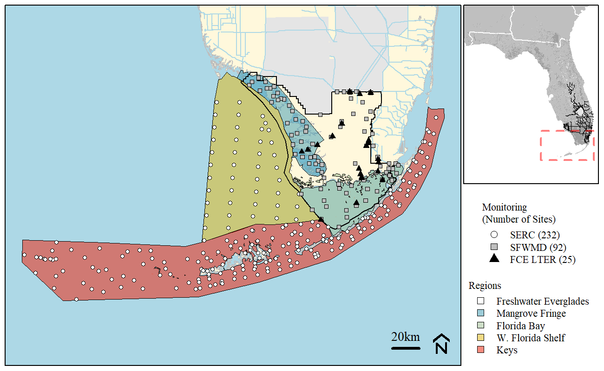
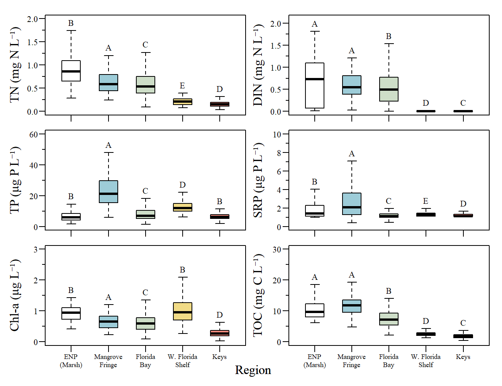
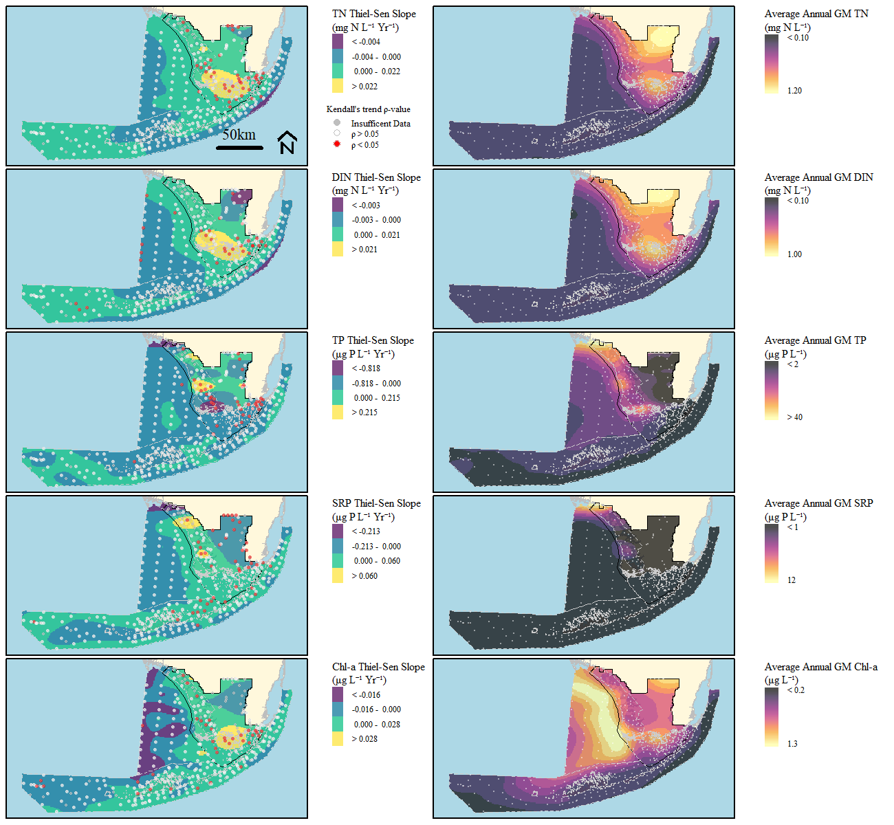

```{r setup, include=FALSE}
library(knitr)

options(htmltools.dir.version = FALSE)
knitr::opts_chunk$set(warning = FALSE, message = FALSE, echo=FALSE)

##
library(flextable)
library(magrittr)
library(plyr)
library(reshape2)

wd="C:/Julian_LaCie/_GitHub/EVER_FKNMS_WQTrend"

plot.path="C:/Julian_LaCie/_GitHub/EVER_FKNMS_WQTrend/Plots/"
export.path="C:/Julian_LaCie/_GitHub/EVER_FKNMS_WQTrend/Export/"

plot.figs=list.files(plot.path,full.names=T)
slides.figs="C:/Julian_LaCie/_GitHub/EVER_FKNMS_WQTrend/slides/plots"
file.copy(plot.figs,slides.figs,overwrite=T,recursive=T)

### 
# Functions
notidy_as_flextable_gam<-function(x,data_t=NULL,data_g=NULL,dig.num=2,r2dig=2,...){
  # needs flextable
  # magrittr
  if(sum(class(x)%in%c("gam"))==1&is.null(data_t)&is.null(data_g)){
    data_t <- notidy_tidy_gam(x)
    data_g <- notidy_glance_gam(x)
  }
  
  std_border=officer::fp_border(color = "black", style = "solid", width = 2)
  data.frame(data_t)%>%
    flextable()%>%
    delete_part(part="header")%>%
    hline(i=which(data_t=="Component"),border=std_border)%>%
    hline(i=which(data_t=="Component")[2]-1,border=std_border)%>%
    bold(i=which(data_t=="Component"))%>%
    align(j=1,part="all")%>%
    hline_top(border=std_border)%>%
    hline_bottom(border=std_border)%>%
    merge_v(j=1)%>%valign(j=1,valign="top")%>%fix_border_issues()%>%
    autofit(part = c("header", "body"))%>%
    add_footer_lines(values = c(
      sprintf("Adjusted R-squared: %s, Deviance explained %s", formatC(data_g$adj.r.squared,digits = r2dig,format="f"), formatC(data_g$deviance,digits = r2dig,format="f")),
      paste0(data_g$method,": ",format(round(data_g$sp.crit,dig.num),dig.num),", Scale est.: ",format(round(data_g$scale.est,dig.num),dig.num),", N: ",data_g$nobs)
    ))
}

```

layout: true

<div class="my-footer">
<span> DRAFT </span>
</div>

---
name: title
class: left, middle

### Southern Everglades and Keys Trend analysis

**Working Title:**<br>Fighting the Tides: Long term spatial and temporal trends of a tropical Freshwater-Estuary-Marine ecosystem.

**DRAFT** - `r paste(format(as.Date("2021-07-22"),"%B %d, %Y"))#,"<br>(Updated:", format(as.Date(Sys.Date()),"%B %d, %Y"),")")`


<!-- this ends up being the title slide since seal = FALSE-->

```{r xaringanExtra, include=FALSE, warnint=FALSE}
# devtools::install_github("gadenbuie/xaringanExtra")
# xaringanExtra::use_webcam()
xaringanExtra::use_tile_view()
# xaringanExtra::use_scribble()
```
.footnote[
Paul Julian PhD [`r fontawesome::fa("fas fa-envelope")`](mailto: pjulian@sccf.org) .small[pjulian@sccf.org]

.small[Use cursor keys for navigation, press .red["O"] for a slide .red[O]verview]
]
---
name: objectives

### Objective

* Study was to evaluate spatial and temporal trends across the southern Everglades, West Florida Shelf, Florida Bay and Florida Keys. 

### Questions

This study was used to address two specifc questions related to temporal and spatial trends in water quality: 
1. how do spatial and temportal trends vary in nutrients and chlorophyll concentrations across between freshwater and marine ecosystems over a multi-decadal period; and 

2. how do exogenic drivers such as changes in water and nutrient management and disturbances (i.e. fire, low-temperature anomalies, drought, floods, hurricanes, etc.) interact to influence nutrients and cholorophyll concentrations across the freshwater-marine aquatic continuum. 

---
name: data

### Data

* Water Quality Data collected between May 1995 and May 2019

**Data Sets**
* Southeast Environmental Research Center of Florida International University (SERC)
* Florida Coastal Long-Term Ecological Research (FCE LTER)
* South Florida Water Management District (SFWMD)

**Parameters**
* Total phosphorus (TP)
* Ortho-phosphate/soluable-reactive phosphorus (SRP)
* Total nitrogen (TN)
* Dissolved inorganic nitrogen (DIN; calculated as nitrate + nitrite + ammonia)
* Chlorophyll-a (Chl-a)

---
name: map

### Sampling Map

```{r,out.width="100%",fig.align="center",fig.cap="Long-term monitoring locations sampled by SERC, FCE and SFWMD."}


```

---
name: RegionalComp

### Regional Comparison

```{r,out.width="70%",fig.align="center",fig.cap="Comparison of annual geometric mean total nitrogen (TN), dissolved inorganic nutrient (DIN), total phosphorous (TP), soluble reactive phosphorus (SRP) and chlorophyll-a (Chl-a) concentrations across the five regions across the study area. Letters above boxplots indicate pairwise comparisons between regions using Dunn’s test of multiple comparisons."}


```

---
name: Trend

### Trend

Figure caption

**Left:** Annual rate of change for geometric mean total nitrogen (TN), dissolved inorganic nutrient (DIN), total phosphorous (TP), soluble reactive phosphorus (SRP) and chlorophyll-a (Chl-a) concentrations at individual stations across the Everglades-Florida Bay-West Florida Shelf-Keys ecosystem during the period of record. **Right:** Average annual geometric mean TN, DIN, TP, SRP and Chl-a concentrations  across the study area.

Plot is on the next slide.
---
name: Trend
```{r,out.width="90%",fig.align="center"}


```
<!-- .center[.small[**Left:** Annual rate of change for geometric mean total nitrogen (TN), dissolved inorganic nutrient (DIN), total phosphorous (TP), soluble reactive phosphorus (SRP) and chlorophyll-a (Chl-a) concentrations at individual stations across the Everglades-Florida Bay-West Florida Shelf-Keys ecosystem during the period of record. **Right:** Average annual geometric mean TN, DIN, TP, SRP and Chl-a concentrations  across the study area.]] -->
---
name: TNGAM

### TN Spatio-temporal Model
```{r,out.width="120%",fig.align="center",fig.cap="Total Nitrogen spatial and temporal generalized additive model effects plot. "}


```

---
name: TNGAM_tab

### TN Spatio-temporal Model

```{r}
m.TN.sum=read.csv(paste0(export.path,"TN_gam_mod_sum.csv"))
m.TN.est=read.csv(paste0(export.path,"TN_gam_mod_est.csv"))
notidy_as_flextable_gam(x=NULL,data_t=m.TN.est,data_g=m.TN.sum)
```

---
name: TPGAM

### TP Spatio-temporal Model
```{r,out.width="120%",fig.align="center",fig.cap="Total Phosphorus spatial and temporal generalized additive model effects plot. "}


```

---
name: TPGAM_tab

### TP Spatio-temporal Model

```{r}
m.TP.sum=read.csv(paste0(export.path,"TP_gam_mod_sum.csv"))
m.TP.est=read.csv(paste0(export.path,"TP_gam_mod_est.csv"))
notidy_as_flextable_gam(x=NULL,data_t=m.TP.est,data_g=m.TP.sum)
```

---
name: climate

<br>
```{r,out.width="100%",fig.align="center",fig.cap="Altantic Multi-decadal Oscillation (AMO) and Pacific Decadal Oscillation (PDO) index (1870 - 2021). Data source: NOAA."}


```

---
name: climate

<br>
```{r,out.width="100%",fig.align="center",fig.cap="Altantic Multi-decadal Oscillation (AMO) and Pacific Decadal Oscillation (PDO) index (1995 - 2021). Data source: NOAA."}


```

---
name: Hydro

<br>
```{r,out.width="100%",fig.align="center",fig.cap="Annual hydroperiod and discharge volumes for Shark River Slough (SRS; top) and Taylor Slough and Coastal Basins (TSCB; bottom) between May 1, 1995 and Apirl 30, 2019 (WY1996 – 2019). "}

knitr::include_graphics("./plots/Hydro_Trend.png")
```
